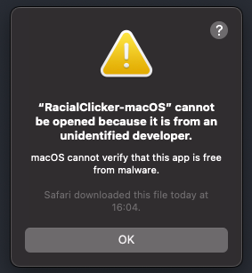
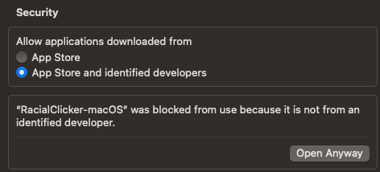
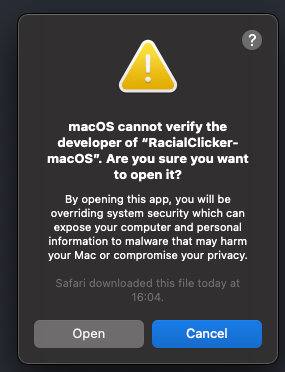

# RacialClicker


RacialClicker is a simple auto-clicker application written in C# that simulates mouse clicks at a given rate. It allows
users to define a target clicks per second (CPS) and toggle the auto-clicker functionality using a specific keyboard
key.

## Features

- Simulate mouse clicks at a user-defined rate.
- Toggle the auto-clicker on/off using a customizable keyboard key.
- Automatically calculates a CPS range to ensure a realistic clicking rate.

## Compatibility

RacialClicker is designed to work on the following platforms:

- **Windows**
- **macOS** (including Apple Silicon support)
- **Linux**

## Installation Guide

Follow these steps to install and run the auto clicker on your system:

### 1. Download the Latest Release

Visit the [releases](https://github.com/RacialGamer/AutoClicker-Cpvp/releases) page of this GitHub
repository. Locate and download the latest release for your specific platform (Windows, MacOS, Linux).

*Note: If your platform isn't provided, you can compile the application from its source code.*

### 2. Run the Application

Once you've downloaded the executable file, open it to run the auto clicker.

#### For MacOS Users (UNIX Based systems can be a pain :-):

To make the downloaded file executable, follow these steps:

1. **Open Terminal:** Launch the Terminal application on your macOS system.

2. **Navigate to the Directory:** Change the current directory to the one that contains the auto clicker file. You can
   use the `cd` command to navigate to the appropriate directory.

3. **Grant Execution Permission:** Run the following command in the Terminal. Make sure to replace `RacialClicker-macOS`
   with the actual name of the downloaded file:

   ```shell
   chmod +x RacialClicker-macOS
   ```

   This command uses the `chmod` utility to grant execute permission to the specified file. The `+x` flag allows the
   file to be executed as a program.

By following these steps, you'll successfully make the downloaded auto clicker file executable and ready to use.

Since the application isn't signed, MacOS might prevent it from running by default. To allow the application to run,
follow these steps:

a. Navigate to `System Preferences > Privacy & Security` and scroll down.

b. You'll see a message stating that the application was blocked from running. Click on the `Open Anyway` button next to
the message.

c. A confirmation dialog will appear asking if you're sure you want to open the application. Click `Open` to proceed.
This process is illustrated in the following images:





### 3. Enabling Accessibility API (MacOS Only)

To use the auto clicker, you need to enable the Accessibility API on your system. This allows the application to
interact with other programs and automate clicking.

a. Go to `System Preferences > Privacy & Security > Accessibility`.

b. Check the box next to the Auto clicker to grant it accessibility permissions.

c. If the application is not listed, click the `+` button and navigate to the application's location to add it.

d. Once added, make sure the checkbox is enabled for the application.

e. Restart the auto clicker for the changes to take effect.

## Compile from source

1. Clone this repository to your local machine.
2. Open the solution in your preferred C# development environment (e.g., Visual Studio, Visual Studio Code with
   appropriate extensions).
3. Build the project to compile the application.

## Usage

1. Run the compiled executable (`RacialClicker.exe` on Windows, `RacialClicker` on macOS/Linux).
2. The application will prompt you to enter your target CPS (clicks per second).
3. Once your target CPS is set, press any key to define the toggle key for enabling/disabling the auto-clicker.
4. Press the chosen toggle key to start or stop the auto-clicking loop.
5. The application will print messages indicating the status of the auto-clicker.

## Disclaimer

**Please Note:** This application is provided for educational and illustrative purposes only. Automating mouse clicks
using this tool might be against the terms of use of certain applications, games, or websites. Be aware that using
automated scripts in such contexts could result in punishments, bans, or anticheat detections.

By using this application, you understand and agree that:

- The developers and maintainers of this application are not responsible for any consequences resulting from the misuse
  of this tool.
- We do not endorse or encourage the use of automated clicking tools in situations where it may violate terms of use,
  disrupt fair play, or harm user experiences.
- The auto-clicker's randomizer feature has not been tested to ensure bypassing effective anticheat systems.

Use this tool responsibly and at your own risk. Make sure you have proper authorization to use it in the intended
environment.

## License

This project is licensed under the MIT License - see the [LICENSE](LICENSE) file for details.